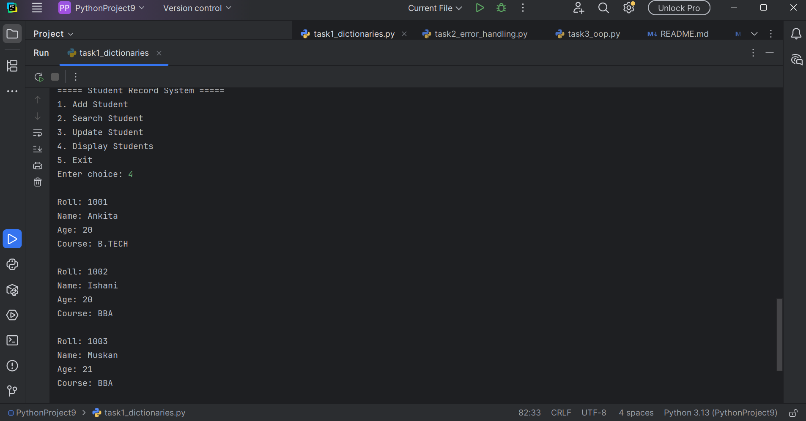
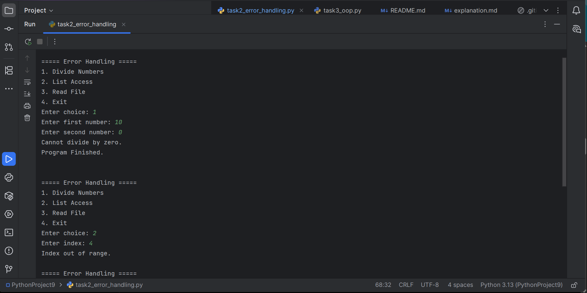
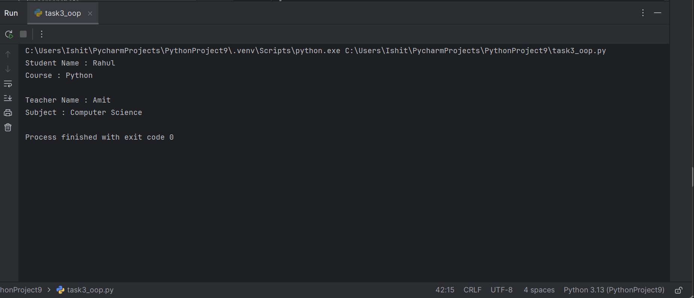

# Week 3 Python Development

This repository contains the Week 3 internship tasks.

## Task 1
Dictionary-based Student Record System

Features:
- Add Student
- Search Student
- Update Student
- Display Students

## Task 2
Error Handling

Examples:
- ZeroDivisionError
- ValueError
- IndexError
- FileNotFoundError

## Task 3
Object-Oriented Programming

Concepts:
- Classes
- Objects
- Inheritance
- Polymorphism

Language:
Python 3

IDE:
PyCharm